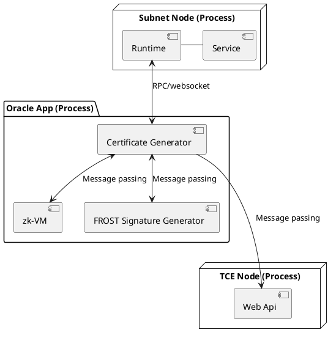

# Topos Node

## Overview of the components

```plantuml
@startuml
node "Subnet Node (Process)" as subnet_node {
    [Runtime]-[Service]
}

node "TCE Node (Process)" as tce_node {
    [Web Api]
}

package "Oracle App (Process)" as oracle_app {
    [zk-VM]
    [Certificate Generator]
    [FROST Signature Generator]
}

[Runtime] <--> [Certificate Generator]: RPC/websocket
[Certificate Generator] <--> [FROST Signature Generator]: Message passing
[Certificate Generator] <--> [zk-VM]: Message passing
[Certificate Generator] ---> [Web Api]: Message passing

@enduml
```
